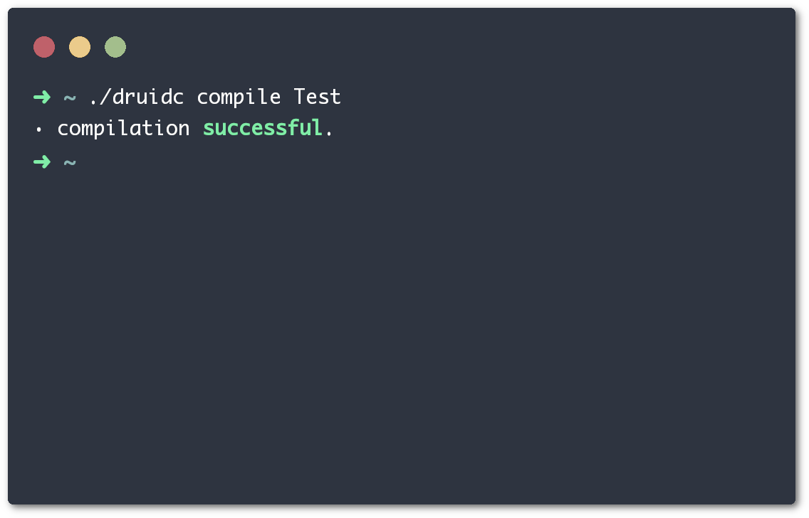

<div align="center">
    
</div>

# The PyDruid compiler

<div align="center">
    
</div>

PyDruid is the first ever Druid compiler that I wrote. It's basically meant to compile the actual Druid compiler in written in Druid, which is compiled to machine code rather than being a bunch of Python scripts.

##  __Warning__
This repository is still under development and __won't__ work in any way.

##  What's Druid?
Druid is a strong-typed object-oriented programming language. It's a mix of my favourite features of my favourite programming languages (Python, Java, C, etc...) that compiles into C to be later compiled to machine code.

##  Why PyDruid?
Well... the Druid source code is being written in Druid (as paradoxically as it might sound), so a single C compiler cannot compile the Druid source code. There must be a _primitive_ Druid compiler in order to compile the actual Druid repository. PyDruid is meant to be this compiler, which can be run using Python on any computer to compile the compiler.

##  Install
Simply you don't install it. You need just a requeriment to run it, which is Python (and preferably running on Linux). The compiler is called by running the file ```druidc```, in the root directory of the git repository.

##  Compile
If you have your Druid source code done, you need pass all the files to the compiler with the ```compile``` option. There's a JSON file containing the compiler default properties in the same path of the git repo, so you can modify the C compiler and its flags. By default, it uses GCC with no flags.
```
$ ./druidc compile example.druid
```
Of course, you need to change ```example.druid``` by all your files. All the dependencies __must__ be satisfied, because the compiler will crash with an error if any dependency is broken, so __make sure__ you import __all__ the required Druid files.

##  Other options
The compiler can do more things, such as initializing projects, for example. It basically does everything that the actual Druid compiler does, so if you want to get a list with all the available options, just use the option ```help```.

##  License
This software is released under the CC BY-NC-SA license, which allows you to modify and share my work, as long as you give attribution to me and don't earn any money from this work. However, if you made a program using Druid, you're free to do whatever you want with your program.

<div align="center">
    
</div>
