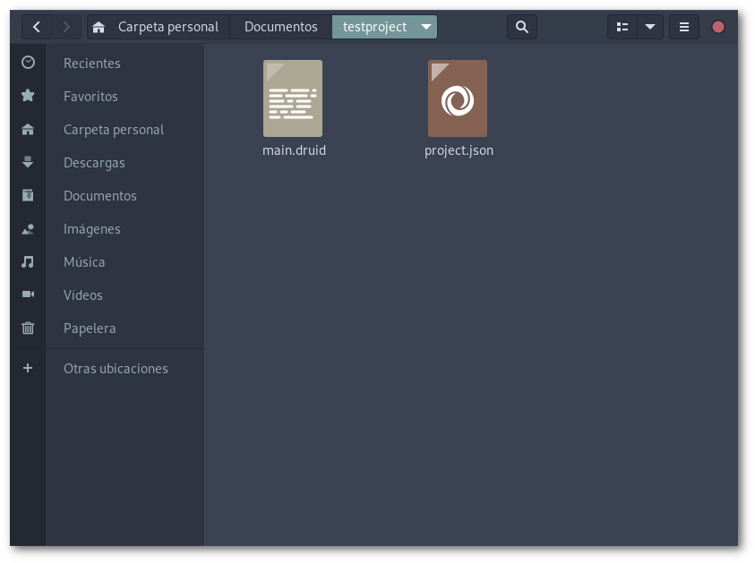
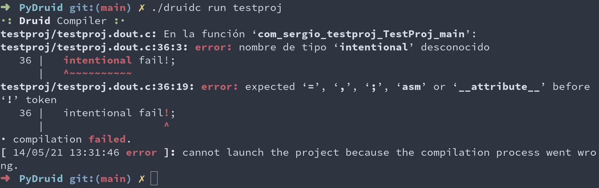

<div align="center">
    
</div>

# Compiler options
The compiler uses options in order to manage projects:

##  The __compile__ option
The ```compile``` option needs to take a project name. Then the compiler reads all the source code inside that project and compiles it using a C compiler.

```
$ ./druidc compile TestProject
```

Then you should have a executable file with the same name of the project in lower case. Remember you can modify the compilation paremeters in the ```project.json``` file.

##  The __init__ option
This option generates a new Druid project, featuring a project index and a main Druid file, but this file can be changed by you in the project index.

```
$ ./druidc init TestProject
```

After running the program and getting this message:
```
· compilation successful.
```
You should have a folder with this two files.

<div align="center">
    
</div>

##  The __help__ option
It doesn't take any argument and just displays a list of available options.

```
$ ./druidc help
```

##  The __run__ option
This option does the same than ```compile```, but when compilation ends, it runs the generated program. Of course, if the compilation goes wrong, it won't launch anything and will print an error message, like this one:

<div align="center">
    
</div>
